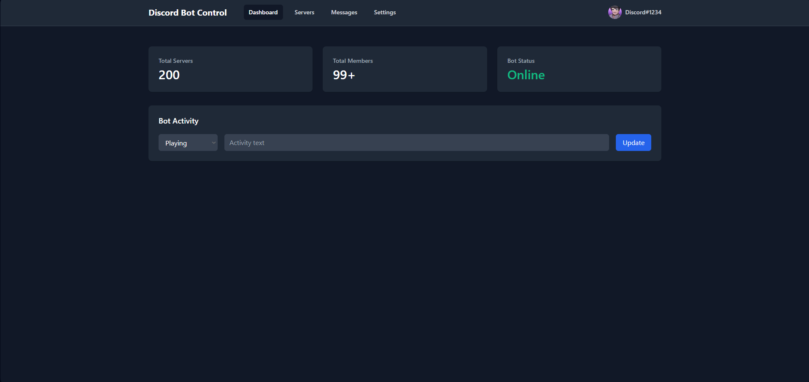

# Discord Bot Control

<div align="center">
  
  
  
  

</div>


A Discord bot control system that allows for managing and interacting with Discord bots.

Created by [r3dc0dez](https://github.com/r3dc0dez)

## Features

- Bot management and control
- Command handling
- Easy-to-use interface

### Demo Screeshots



## Prerequisites

- Node.js 16.x or higher
- npm (Node Package Manager)
- Discord.js library
- Other dependencies (specified in package.json)

## Installation

1. Clone this repository:
```bash
git clone https://github.com/r3dc0dez/discord_bot_control.git
cd discord_bot_control
```

2. Install the required dependencies:
```bash
npm install
```
or 
```bash
start requirements.bat
```
3. Configure your Discord bot token in the configuration file.

## Usage

1. Set up your Discord bot token in the config file
2. Run the main bot script:
```bash
npm start
```
or
```bash
start start.bat
```

## Contributing

Contributions are welcome! Please feel free to submit a Pull Request.

## License

This project is licensed under the MIT License - see the LICENSE file for details.

## Support

If you have any questions or need help, please open an issue in the repository.
